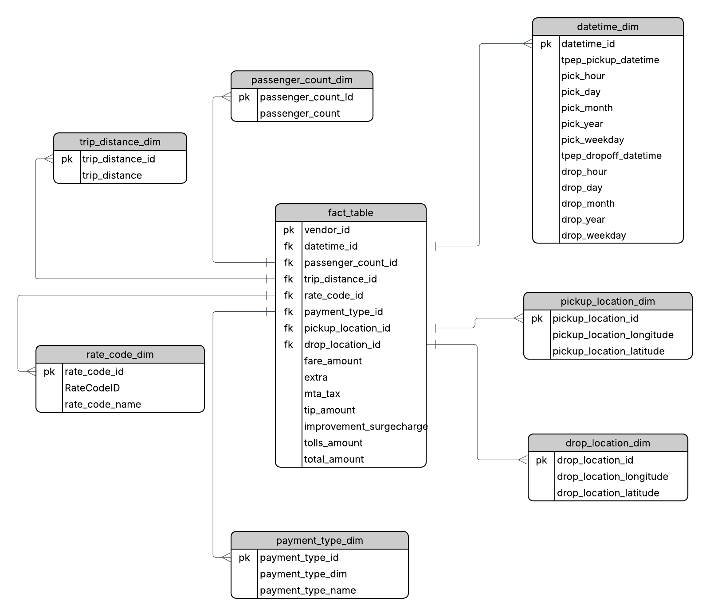

# Logical Data Modeling – NYC Yellow Taxi Trip Data (Python)

## Overview
This project focuses on **logical data modeling and dimensional dataset construction** using NYC Yellow Taxi trip data.

The emphasis is on understanding the data, defining the analytical grain, and structuring the dataset into fact and dimension tables using Python. The project demonstrates how raw transactional data can be reshaped into analytics-ready datasets without relying on a physical database.

---

## Dataset
**Source:** NYC Yellow Taxi Trip Records (TLC)

The dataset contains trip-level transactional data including pickup and drop-off timestamps, passenger count, trip distance, fare components, payment type, and pickup/drop-off locations.

An official source data dictionary provided with the dataset was used as a reference for raw column definitions.

---

## Grain Definition
**Grain:**  
One row in the fact dataset represents **one completed taxi trip**.

All transformations and dataset splits are consistent with this level of detail.

---

## Data Model

The logical data model follows a **star-schema-style structure**:

- One central fact dataset representing taxi trips
- Multiple dimension datasets providing descriptive context

### Fact Dataset
**fact_trips**
- One row per completed trip
- Contains numeric measures such as fare amount, tip amount, tolls amount, and total amount
- References dimension datasets via surrogate keys

### Dimension Datasets
- `datetime_dim` – pickup and drop-off timestamps with derived time attributes
- `passenger_count_dim` – passenger count categories
- `payment_type_dim` – payment method codes and descriptions
- `rate_code_dim` – rate code classifications
- `pickup_location_dim` – pickup location coordinates
- `drop_location_dim` – drop-off location coordinates

---

## Data Cleaning & Transformation
All data cleaning and transformations were performed using **Python (pandas)**.

Key steps include:
- handling missing and invalid values
- enforcing consistent data types
- removing duplicate dimension records
- generating surrogate keys for dimension datasets
- splitting the raw dataset into fact and dimension datasets

The full transformation logic is implemented in the project notebook.

---

## Data Quality & Validation
Data quality checks are performed programmatically using Python.

These include:
- validating non-null surrogate keys
- checking non-negative monetary and distance values
- ensuring pickup timestamps occur before drop-off timestamps
- validating fact-to-dimension relationships using pandas merges
- confirming row counts remain consistent after transformations

These checks ensure logical correctness of the data model.

---

## Analytical Validation
To validate that the model supports analytical use cases, Python-based aggregations were performed, such as:
- trip volume by hour and weekday
- average fare by passenger count
- payment type-based summaries
- pickup vs drop-off pattern analysis

This confirms that the model supports common analytical questions.

---

## Project Scope
This project focuses exclusively on **logical data modeling and data preparation using Python**.

It does not include:
- SQL table creation
- database-level constraints
- warehouse or BI tool integration

The scope is intentionally limited to emphasize modeling fundamentals and data correctness.

---

## Tools Used
- Python (pandas)
- Google Colab
- Lucidchart
- Excel (lightweight validation)

---

## Key Takeaway
A clear grain definition and a disciplined separation of facts and dimensions are essential for reliable analytics. This project highlights how thoughtful data modeling can significantly simplify downstream analysis, even before data is loaded into a database.
